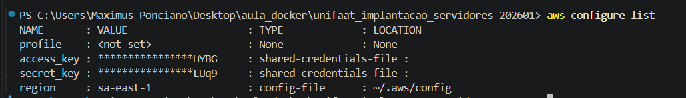
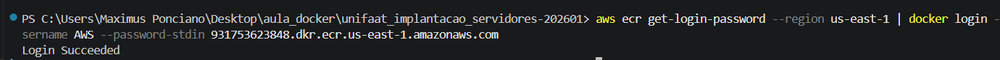
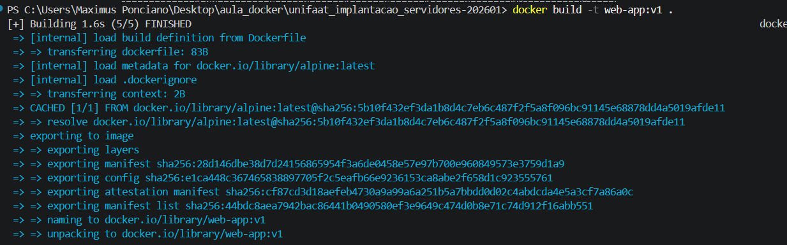
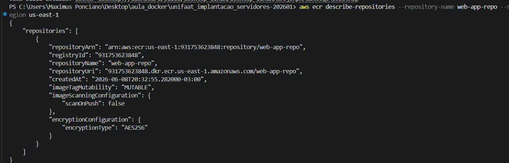
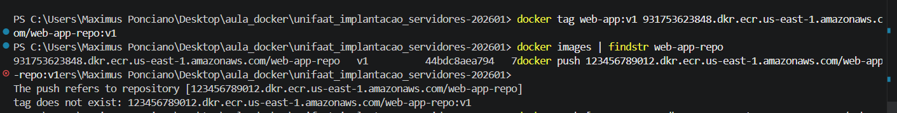
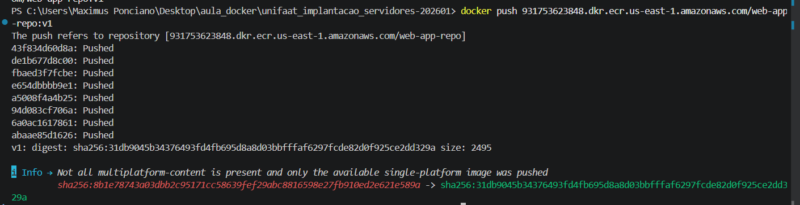
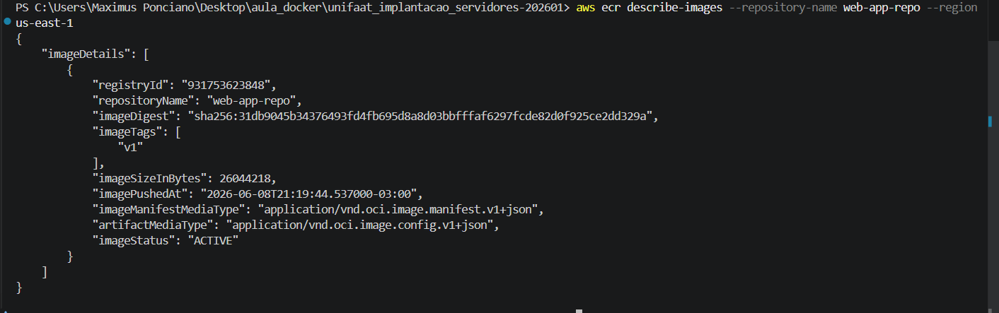

# TF - Aula 12 - CI/CD Básico e Registro de Imagens (ECR)

## 📌 Questão 1: Conceitos de CI/CD (Teórica)

a) **CI (Continuous Integration):** O objetivo principal é automatizar a integração de alterações de código de múltiplos desenvolvedores em um repositório compartilhado de forma frequente. Nesta fase, o código é buildado automaticamente, passa por testes (unitários, de integração, etc.) e validações de qualidade de forma automatizada para detectar bugs o mais cedo possível.

b) **CD (Continuous Delivery/Deployment):** O objetivo principal é automatizar o fluxo de liberação do artefato que passou com sucesso pela fase de CI.
- No *Continuous Delivery*, o artefato buildado é implantado automaticamente em ambientes de homologação/staging, mas a ida para a produção exige uma aprovação manual.
- No *Continuous Deployment*, todo artefato aprovado nos testes é implantado automaticamente direto em produção, sem intervenção humana.

---

## 📌 Questão 2: Ferramentas de Pipeline (Teórica)

Três ferramentas amplamente utilizadas para automatizar a fase de CI, executar testes e fazer o build de imagens Docker são:
1. **GitHub Actions** (Nativo do GitHub)
2. **AWS CodeBuild** (Serviço gerenciado da AWS)
3. **Jenkins** (Ferramenta open-source self-hosted)

---

## 📌 Questão 3: Amazon ECR (Teórica)

a) **Vantagem em relação ao Docker Hub Público:** A principal vantagem é a **segurança e o controle de acesso nativo**. O ECR armazena imagens de forma estritamente privada por padrão, integrando-se nativamente ao AWS IAM (Identity and Access Management). Isso garante que apenas instâncias, serviços (como EKS/ECS) ou usuários explicitamente autorizados na sua conta AWS possam fazer pull/push das imagens, além de oferecer escaneamento automático de vulnerabilidades.

b) **Escopo e Formato do URI:** O Amazon ECR é um serviço **regional**. O formato padrão do URI de um repositório ECR segue a estrutura:
`[AWS_ACCOUNT_ID].dkr.ecr.[AWS_REGION].amazonaws.com/[REPO_NAME]`

---

## 📌 Questão 4: Processo de Push (Prática Teórica)

1. **Passo de Autenticação:** É necessário gerar um token de autenticação temporário via AWS CLI e passá-lo para o comando do Docker se autenticar no registry da AWS. (*Ferramenta: AWS CLI + Docker CLI*).
2. **Passo de Tagging:** É preciso mapear/marcar a imagem local adicionando uma nova tag que contenha o endpoint/URI completo do repositório remoto do ECR. (*Ferramenta: Docker CLI*).
3. **Passo de Upload:** Executa-se o envio das camadas (layers) da imagem local para o repositório remoto da AWS. (*Ferramenta: Docker CLI*).

---

## 📌 Questão 5: Tarefa Prática Integrada (Simulação com AWS CLI e Docker)

Com base nos dados fornecidos:
- **ID da Conta AWS:** `931753623848`
- **Região:** `us-east-1`
- **Nome do Repositório ECR:** `web-app-repo`
- **Imagem Local:** `web-app:v1`

Comantos simulados correspondentes:

a) **Criação do Repositório:**
```bash
aws ecr create-repository --repository-name web-app-repo --region us-east-1
```

**b) Autenticação (Login Docker):**
```bash
aws ecr get-login-password --region us-east-1 | \
  docker login --username AWS --password-stdin 123456789012.dkr.ecr.us-east-1.amazonaws.com
```

**c) Tagging da Imagem:**
```bash
docker tag web-app:v1 123456789012.dkr.ecr.us-east-1.amazonaws.com/web-app-repo:v1
    docker images | findstr web-app-repo
```

**d) Push Final:**
```bash
docker push 123456789012.dkr.ecr.us-east-1.amazonaws.com/web-app-repo:v1
```
---

## 📸 Evidências Práticas da Execução

Abaixo estão anexadas as capturas de tela do terminal que comprovam a execução de cada etapa do laboratório:

### 1. Configuração do AWS CLI


### 2. Autenticação Docker com Sucesso no ECR


### 3. Build da Imagem Local utilizando o Dockerfile


### 4. Verificação/Descrição do Repositorio ECR Remoto


### 5. Tagging da Imagem com o ID da Conta AWS


### 6. Push Completo dos Layers para a AWS


### 7. Verificação Remota da Imagem Ativa no ECR
